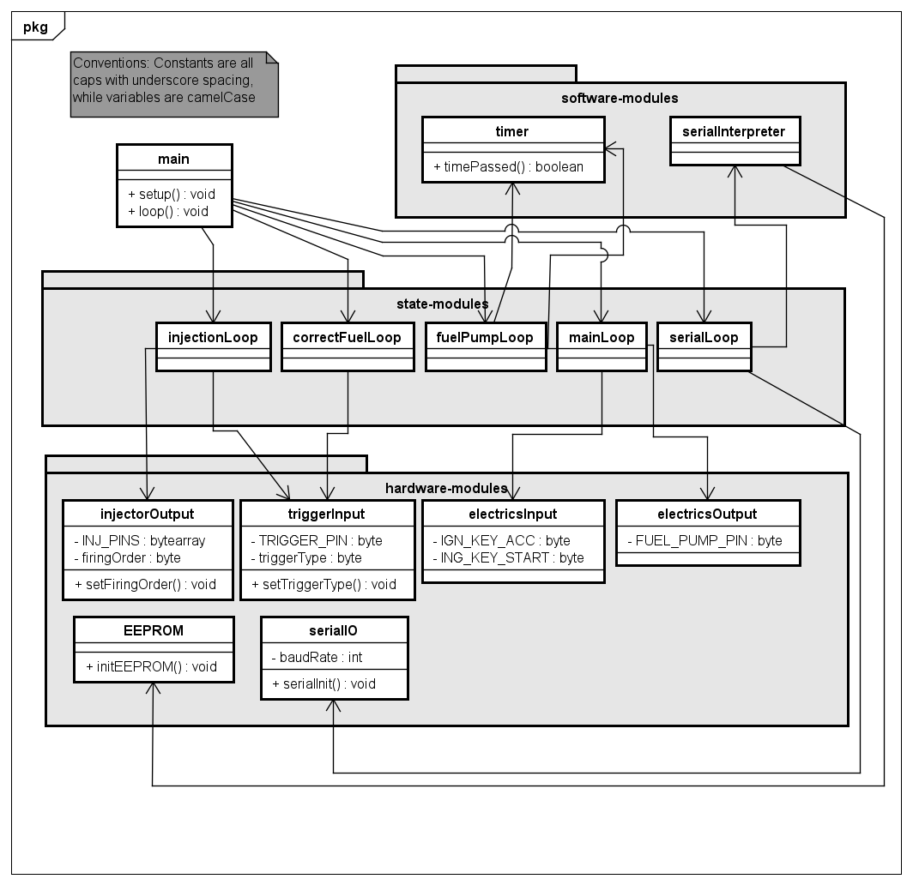

# uno-injection
## A solution for a cheap injection system ran from an Arduino Uno with an additional board.

Ever wanted to convert any old 4 cylinder carbed car with distributor ignition to EFI the cheap way? This will not be easy but it will sure be cheap...
I'm writing this small codebase for the Arduino Uno to take your nugget a decade into the future. 

## The technicals(Hardware):
There will need to be some stuff in order for the 5v Uno to work with the 12-15V your car will supply.
Uno's don't care(in my experience) about the voltage being slightly higher than 5v. But for an appliance 
in your car you want at least some longevity. This is why I will make a 5v Safe zone for the Uno using a buck 
converter and optocouples. For the TPS I will not use an optocouple because they already use a 0-5v signal. I might add a 5v zener diode 
to make sure. For the narrowband o2 sensor I will use a digital pin on the Arduino as it can only report two states; Rich and Lean.

I will use ITB(Individual Thottle Bodys)'s from a Suzuki motorbike as my new inlet manifold. These are found for a couple 100 euros and usually come
with TPS and MAP sensors. You will need to find ITB's that will fit your car. I might add support for single throttle body injection,
but it will have worse throttle response and tunability compared to ITB's however they will be easier to find/install.

This system needs distributor ignition to work, for it won't be able to send spark signal. Also a trigger pulse is needed which
can be obtained from a built in CAS in the distributor(not excessively common) or a trigger wheel with hall sensor.

## The technicals(Software):
The program will feature a couple of simple loops alongside one another to check for various sensor readings and conditions.
These loops include a main loop(for checking whether the engine is idling, revving or even off), a fuel pump loop(for turning 
on and off the fuel pump under certain conditions) and a fuel correction loop(to change the amount of fuel being injected).

I will implement a way to program it through the UART interface but this is still far into the future. For now I will try to set a basic
system to send injector pulses at the right time.

## But why not use Speeduino?
Well, honestly Speeduino is going to be a better option in any case. However I'm trying to make something cheap to just convert
an awful carbed car to EFI and I think I don't need all the functionality the Speeduino offers. This mainly cuts cost. If you've
got the dime to spare then I would greatly suggest to support Speeduino because it's a great project.

## The warnings:
Please note that this is and will probably stay only a very bare Engine Management System. I will not take responsibility for 
any harm or damage caused by implementing this.  
